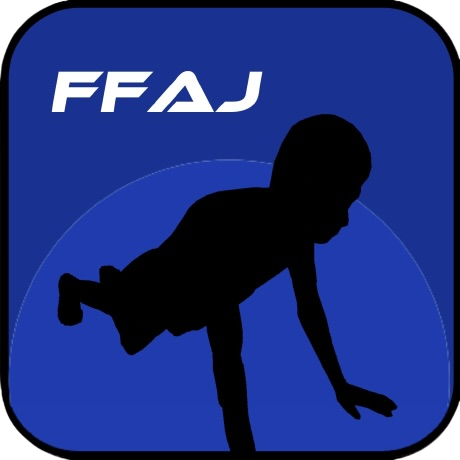

<p align="center">

</p>

<div align="center">

# Form For the Average Joe

**National University of Singapore**  
Orbital 2022 - Form For Average Joe  
Koh Chee Heng | Gujar Parth Shailesh  
</div>

## Deployment
>https://form-for-average-joe.web.app/
  
## Features
Below are the features that have been implemented for Milestone 1:

***Signup and Login System***  
Currently, we have a system where unregistered users can perform the exercises and gain feedback, but in order to save the session statistics, they need to be logged in. Currently, we have three authentication methods: Google, GitHub, and the standard email and password procedure. The app will request you to sign in if it detects that you are attempting to access pages that require data from signed-in users. The app also persists your authentication credentials, so that you do not have to keep signing in after closing the browser session.

***Push-ups and Sit-ups rep counting***  
The web-app is able to detect the pose of the user and decide if one rep of that particular exercise has been completed. This is done so by first recognising the starting position. In the case of push-ups, the starting pose is the standard push-up position with arms straightened. Next, it waits for the user to move to the reverse-point position. This refers to when the user attempts to do a push-up and has bent his/her arm to the required depth. The rep is registered when the user returns back to the starting position.

***Push-ups and Sit-ups form checker***  
While counting reps, the web-app also has another algorithm to check if, at any point during the rep, the user is not maintaining proper exercise posture. Improper posture for each exercise is unique. For push-ups, it refers to a curved back, unstraightened arms or not going low enough. Everytime improper posture is detected, the corresponding rep will not be counted. Difficulty levels can be set by manipulating the threshold values. For instance, how curved can the back be before it is considered improper form.

***Customisable Time and Exercise Difficulty***  
The web-app allows users to change difficulty levels (stringency) and to set the amount of duration of the exercise. Somebody doing the standard IPPT would set the time to 1 minute while somebody only doing training might set it to 30 seconds. The exercise will cut (stop counting reps) when the timer reaches zero.

  
## Tech Stack
1. **Frontend (state management)** - ReactJS (Redux)
2. **Backend services** - Firebase
3. **Pose detection** - TensorflowJS
  
## Challenges
**Milestone 1**
  
*Frontend design* - as neither of us has had extensive experience with HTML/CSS before, we found it difficult to achieve the styling we wanted, as our styling approach sometimes led to bugs.
  
*Selection of the pose detection model* - initially we were using a different model called OpenPose. OpenPose was rather unsuited for our use-case, as it relied on GPUs to ensure its accuracy.
  
*Pose detection accuracy* - while the MoveNet model is able to accurately track the key points of a human body, it was difficult to design a robust algorithm that prevents users from cheating. As present, we are using assumptions on the relative positions of body parts to determine the user’s movements. However, this can be unreliable as there exists corner cases in which the user is in an incorrect position but the algorithm does not detect it.
  
## Demo
[](https://youtu.be/8pN9LdhJhwU "Push-Up Demo")
  
## Set-up to run locally
```
$ npm install --global yarn # You will need yarn v1.

$ yarn # Install dependencies

$ yarn start # Lauch the frontend

$ yarn firebase emulators:start # Run this in a separate terminal, to launch the Firebase backend 
```
  
## Donations
